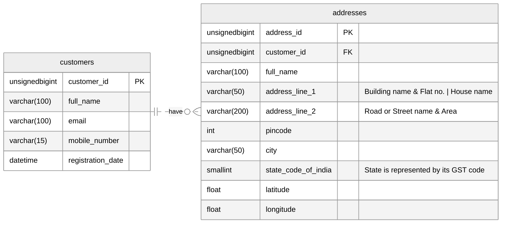

# A Billion Customers
A system designed for information retrieval using REST APIs, consisting of a billion customers.

#### Customers Data Schema
The schema is for a relational database management system

#### Generating Data

Todo

#### Importing Data into postgres

Todo

#### Querying Data

Following are the kinds of queries this system is designed to handle:

- API
    - Retrieve a customer with all addresses given mobile number or email.
    - Retrieve a customer given a customer_id.
- Analytics
    - Retrieve customers and count of customers registered in a given month or a year.
    - Retrieve customers and count of customers that belong to a particular city or state.
    - Retrieve customer and count of customers that are covered by a given pincode